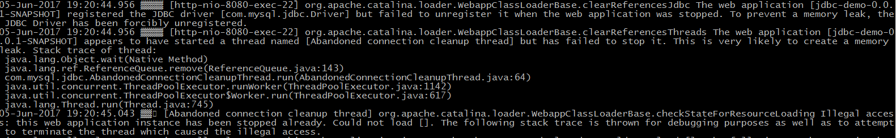
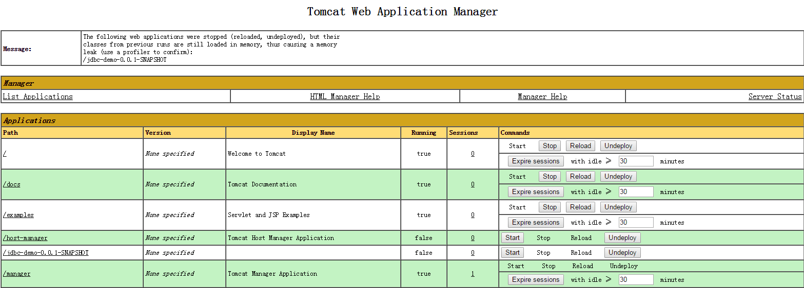

# 问题描述
在使用tomcat容器部署Elastic-Job时可能存在内存泄露的问题，每stop一次就会多一个内存泄露项.
经过研究发现这跟tomcat的应用销毁机制关系密切，简单来说默认情况下tomcat不会强制销毁webapp创建的线程，
而这些线程的context classloader是webapp classloader，如果webapp停止的时候这些线程没有被正确结束，就
会有指向webapp classloader的引用存在导致webapp classloader无法被回收，进而造成内存泄露。
更多资料请参考：

https://wiki.apache.org/tomcat/MemoryLeakProtection

https://tomcat.apache.org/tomcat-8.0-doc/config/context.html clearReferencesStopThreads配置项

org.apache.catalina.loader.WebappClassLoaderBase源码

# 如何解决
这个问题一般通过创建一个ServletContextListener，在应用销毁的时候触发执行，把webapp自己创建的线程清理干净。
由于Elastic-Job设计时不依赖于web容器运行，通过这种方法解决会增加Elastic-Job对容器框架的依赖，所以建议如果
将Elastic-Job部署与web容器中运行，直接重启web容器就可以了。

# 其他框架
以互联网使用最多的数据库mysql为例，写了一个简单的demo应用，直接通过tomcat的manager启停应用，验证发现mysql的jdbc驱动也会存在内存泄露问题

# 项目使用
1. 修改application.yml中数据库配置
1. 打包war,执行 `mvn -DskipTests package`,在target目录下找到jdbc-demo-0.0.1-SNAPSHOT.war
1. 启动Tomcat（可通过catalina.sh run命令查看日志）
1. 使用tomcat manager工具启停jdbc-demo-0.0.1-SNAPSHOT,并点击“Find leaks”检查内存泄露.
